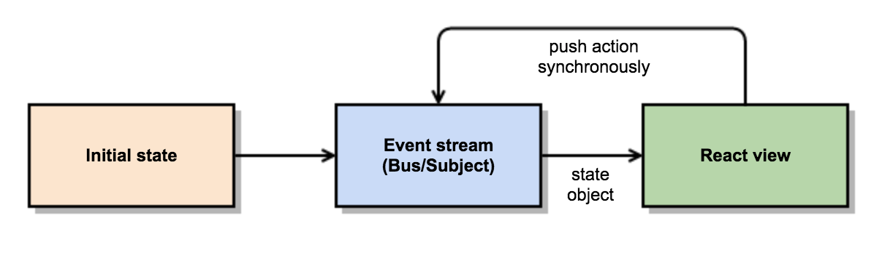

Facebook introduced [Flux](https://facebook.github.io/flux/) about a year ago for
client-side web application building and since then it has become one of the hottest
tech in the web development scene.

The task of Flux is to isolate business logic from the user interface logic by
using dispatcher, stores and actions. The core idea is the unidirectional data
flow which means that actions are propagated through the entire system in response
to user interactions but they have no binding to the internal data model:

 <span class="imglabel">Flux data flow by Facebook</span>

The first time I heard about Flux, my first thoughts were “that is a very good idea”.
I still have the same thoughts: especially the unidirectional data flow combined
with React’s [Virtual DOM](https://reactjs.org/docs/glossary.html) makes view
implementations neat and simple since there is no need for state diffing. However,
Flux is **heavy**: it introduces much boilerplate (event emitters, listeners) and has
a slight enterprise smell (conventions, layering) with it. That’s why I started
to find a simpler way to achieve same functionality and loose coupling but without
Flux’s boilerplate code.

### React and FRP

[Functional Reactive Programming (FRP)](https://en.wikipedia.org/wiki/Functional_reactive_programming)
is a programming paradigm where events are modeled as **event streams**. Event streams
are like (immutable) arrays: they can be mapped, filtered, combined and merged.
The difference between arrays and event streams is that values (events) of the
event stream occur asynchronously. Every time when event occurs, it’ll be propagated
through the stream and finally consumed by the subscriber.

As the name implies, **React**ive programming is what React is made for. Actions
happen eventually and they propagate through the event streams.
**Combination of those event streams forms the application’s state.** After the
event has propagated through the system, the new application state object is
consumed by the subscriber and rendered by the **root level** React component.
This makes the data flow dead simple:

 <span class="imglabel">React+FRP data flow</span>

The whole state propagation logic can be implemented with the following code. I’ve
used [Bacon.js](https://github.com/baconjs/bacon.js) as my FRP library but it
could be anything, e.g. [Rx](https://github.com/ReactiveX/rxjs):

```js
// app.js
const React   = require('react'),
      Bacon   = require('baconjs'),
      TodoApp = require('./todoApp'),
      todos   = require('./todos'),
      filter  = require('./filter')

const filterP = filter.toProperty(<initial filter>),
      itemsP  = todos.toItemsProperty(<initial items>, filterP)

const appState = Bacon.combineTemplate({
  items: itemsP,
  filter: filterP
})

appState.onValue((state) => {
  React.render(<TodoApp {...state} />,
               document.getElementById('todoapp'))
})
```

### No need for separate actions and stores

I never understood the idea of separating actions and stores since it lowers
the cohesion of logical business units. Fortunately event streams are so simple
so that there is no need for separate actions and stores. Instead there is just
a business component that has a “public API” which communicates with the
“business logic” via the local dispatcher:

```js
// todos.js
const Bacon       = require('baconjs'),
      Dispatcher  = require('./dispatcher')

const d = new Dispatcher()

module.exports = {
  toItemsProperty: function(initialItems, filterP) {
    // "business logic"
    const itemsP = Bacon.update(initialItems,
      [d.stream('remove')], removeItem,
      [d.stream('create')], createItem,
      ...
    )
    return Bacon
      .combineAsArray([itemsP, filterP])
      .map(setItemsDisplayStatusBasedOnFilter)

    function createItem(items, newItemTitle) {
      return items.concat([{<new item data>}])
    }

    function removeItem(items, itemIdToRemove) {
      return items.filter(it => it.id !== itemIdToRemove)
    }
    ...
  },

  // "public API"

  createItem: function(title) {
    d.push('create', title)
  },
  removeItem: function(itemId) {
    d.push('remove', itemId)
  },

  ...
}
```

Note that if the business component depends on other components, their event streams
are passed to the component’s initializer. By making these dependencies explicit, circular
dependencies between components can be removed completely. If two components depend
on each other, it indicates the bad design or invalid component responsibilities.

But what is this mystical “dispatcher”? Well.. it is just an object of pushable event
streams (streams that can be both subscribed and consumed):

```js
// dispatcher.js
const Bacon = require("baconjs");

module.exports = function() {
  const busCache = {}; // Bus == Subject in Rx

  this.stream = function(name) {
    return bus(name);
  };
  this.push = function(name, value) {
    bus(name).push(value);
  };
  this.plug = function(name, value) {
    bus(name).plug(value);
  };

  function bus(name) {
    return (busCache[name] = busCache[name] || new Bacon.Bus());
  }
};
```

### Stupid views

Because the state comes from the top level, views are extremely simple: they just render
whatever they are given and the React’s Virtual DOM does the rest! No callbacks, no
listeners. Just synchronous “public API” calls to the business logic:

```js
// todoItem.jsx
const React = require("react"),
  todos = require("./todos");

module.exports = React.createClass({
  render: function() {
    const item = this.props.item;
    return (
      <li className={item.states.join(" ")}>
        <div className="view">
          <label>{item.name}</label>
          ...
          <button
            className="destroy"
            onClick={() => todos.removeItem(item.id)}
          />
        </div>
      </li>
    );
  }
});
```

### Conclusions

Flux is a very nice framework/pattern but it has too much boilerplate and unnecessary
complexity within all its event emitters, listeners, actions and stores. The same idea
is possible to implement with much more simpler way by using event streams and Functional
Reactive Programming. Event streams also enable other cool stuff like
[easy undo/redo actions](https://github.com/antris/blockgame).

Example codes can be found from [this TodoMVC project](https://github.com/milankinen/react-bacon-todomvc).
If abandoning Flux entirely scares too much, I’d recommend to read my colleague’s wonderful
article how to mix Flux with event streams.
