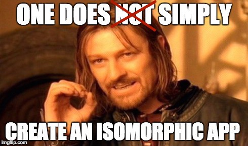
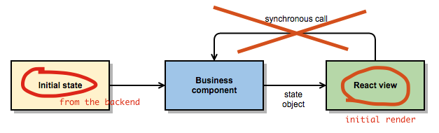

ISOMORPHIC ISOMORPHIC ISOMORPHIC! That is the magic word I hear behind every
corner and see in every front-end forum. New tutorials about isomorphic apps
are springing up like mushrooms after the rain. And what is my response? I’ll
write another tutorial of course.

In my previous post I presented an alternative to Flux by using FRP (Bacon)
and React. I received many responses concerning the isomorphic application
development with FRP and React. That’s why I’m writing this. Isomorphic apps
are almost like “normal” apps when creating them with the FRP. Because the FRP
encourages you to always pass the entire state object to the rendering function,
nothing prevents you to do the same in the backend as well.



Beware - this article contains a lot of code examples because I’ve tried to
keep this tutorial as practical as possible. I assume you have a basic knowledge
about FRP. If not, these tutorials may help. If you’re not familiar with my
previous post, I strongly recommend to read it first. But enough talk,
let’s start coding!

### First step — rendering in the backend

If you have read other tutorials you may already know that React has a
“backend-compatible” function called `renderToString`. It behaves exactly
like render but doesn’t call `componentDidMount` and returns the rendered
HTML as a string instead of placing it into a DOM node. Component & model
in → HTML out. Couldn’t be simpler?

Well... actually, it could be. There are two gotchas you should know
before trying to use `renderToString`:

Your backend must understand JSX syntax
Your front-end modules must be CommonJS compatible
Whether you’re using FRP or not, you’ll need to solve those issues first.
Fortunately they have easy solutions: Babel transpiler supports JSX out
of the box so Babel’s require hook will do the job. And if you are using
Browserify or Webpack, you can use CommonJS style in your modules with no
extra effort.

You also need some kind of backend implementation that serves your
static index file. It should be trivial, here is an example:

```js
// server.js
const express = require("express"),
  fs = require("fs"),
  { resolve } = require("path"),
  serveStatic = require("serve-static"),
  app = express();

const _index = fs.readFileSync(resolve(__dirname, "../index.html")).toString();

app.use("/public", serveStatic(resolve(__dirname, "../public")));
app.get("/", (req, res) => {
  res.set("Content-Type", "text/html");
  res.send(_index);
});

app.listen(3000, () => console.log("Server started"));
```

No magic there. I don’t use any template libraries for index.html rendering
because there is actually no need for them. Here is the _index.html_ file:

```html
<!DOCTYPE html>
<html lang="en">
  <head>
    <meta charset="utf-8" />
    <title>React+Bacon.js • Isomorphic example</title>
    <link rel="stylesheet" href="/public/base.css" />
    <link rel="stylesheet" href="/public/index.css" />
  </head>
  <body>
    <section id="todoapp"></section>
    <footer id="info">
      <p>Double-click to edit a todo</p>
      <p>Created by Matti Lankinen</p>
    </footer>
    <script type="text/javascript" src="/public/bundle.js"></script>
  </body>
</html>
```

Now now. Here starts the interesting part. It is the time to use the React’s
`renderToString` function! And because the whole idea of the React+FRP is to
**always pass the complete state object** to the application component, we can also
do it in the backend as well. Finally we can add the rendered application
to the page with `String.replace`:

```js
// server.js
const express = require("express"),
  fs = require("fs"),
  { resolve } = require("path"),
  serveStatic = require("serve-static"),
  React = require("react"),
  App = require("./client/todoApp"),
  app = express();

const _index = fs.readFileSync(resolve(__dirname, "../index.html")).toString();

app.use("/public", serveStatic(resolve(__dirname, "../public")));
app.get("/", (req, res) => {
  const model = {
    items: [
      { id: 1234, title: "Tsers", states: [], display: true },
      { id: 2345, title: "Foobar", states: [], display: true }
    ]
  };
  res.set("Content-Type", "text/html");
  res.send(
    _index
      .replace("{{APP}}", React.renderToString(<App {...model} />))
      .replace("{{INITIAL_MODEL}}", JSON.stringify(model))
  );
});
app.listen(3000, () => console.log("Server started"));
```

And of course those placeholders must be added to the _index.html_ too:

```html
<!DOCTYPE html>
<html lang="en">
  <head>
    <meta charset="utf-8" />
    <title>React+Bacon.js • Isomorphic example</title>
    <link rel="stylesheet" href="/public/base.css" />
    <link rel="stylesheet" href="/public/index.css" />
  </head>
  <body>
    <section id="todoapp">{{APP}}</section>
    <footer id="info">
      <p>Double-click to edit a todo</p>
      <p>Created by Matti Lankinen</p>
    </footer>
    <script type="text/javascript">
      window.INITIAL_MODEL = {{INITIAL_MODEL}};
    </script>
    <script type="text/javascript" src="/public/bundle.js"></script>
  </body>
</html>
```

The hardest part is now over. The backend replaces the APP placeholder with
the rendered application HTML and completely without any client-side JavaScript.
Search engine crawlers are gonna love your app! If you want, you can turn off
the JavaScript from your browser and open the front page: it should
contain two to-do items.

### Step two — enabling the client-side interactions

Now the backend renders the initial application but that’s not all: the browser
must be able to continue the execution of the app where the backend left it.
And that is where the `INITIAL_MODEL` comes forth.

If you paid attention to the previous codes, you noticed that the same model
which was used in the backend rendering was also appended to the HTML. And yet
again: we can use that model to initialize the application’s state stream in
the browser. Because the modules and data are same, we’ll get the
**same state object** as in the backend, thus producing **exactly same HTML**.
And here is where the virtual DOM rocks: no DOM manipulations are actually
made, only event listeners are added to the DOM.

Here is the client code which must be executed in the browser. Do not worry
about the `filterP` yet, it’ll be explained later:

```js
// client.js
const React = require("react"),
  Bacon = require("baconjs"),
  App = require("./client/todoApp");
const filterP = filter.toProperty(location.hash.substring(1)),
  itemsP = todos.toItemsProperty(INITIAL_MODEL.items, filterP);

const stateStream = Bacon.combineTemplate({
  items: itemsP,
  filter: filterP
});
stateStream.onValue(state => {
  React.render(<App {...state} />, document.getElementById("todoapp"));
});
```

And there you go. Congrats! Your first isomorphic application with React
and FRP and no more than 20 minutes passed.

### Final steps — fine-tuning the URLs

Okay, I cheated a little bit… The app wasn’t fully isomorphic yet because it was
using `window.location.hash` to define the filter value (the filter stream defines
which items are actually displayed in the UI).

Generally using window.location.hash is not a good idea in isomorphic apps because
it is not visible to the server, thus the initial render hasn’t exactly same data
as the browser has. That’s why the filter is not applied in the backend render.

Fortunately the solution is quite easy. Stop using the window.location.hash and
use history object’s `pushState` instead. This allows the application to modify
the browser’s path `http://<hostname>/<path>` without page refresh:

```js
// filter.js
const Bacon = require("baconjs"),
  Dispatcher = require("./dispatcher");

const d = new Dispatcher();
module.exports = {
  toProperty: function(initialFilter) {
    return d.stream("reset").scan(initialFilter || "all", (_, f) => f || "all");
  },

  reset: function(newFilter) {
    history.pushState({}, "", newFilter);
    d.push("reset", newFilter);
  }
};
```

Now the filter is included in the URL so it can be used in the backend. In order
to use it, we must DRY the application state stream initialization and extract it
to its own file so that we can easily use it in the backend:

```js
// appState.js
const React = require("react"),
  Bacon = require("baconjs"),
  todos = require("./todos"),
  filter = require("./filter");

module.exports = function(initial) {
  const filterP = filter.toProperty(initial.filter),
    itemsP = todos.toItemsProperty(initial.items, filterP);

  return Bacon.combineTemplate({
    items: itemsP,
    filter: filterP
  });
};
```

And there we go. The application state stream initialization is available
in the client and in the backend as well:

```js
// server.js
const express     = require('express'),
      fs          = require('fs'),
      {resolve}   = require('path'),
      serveStatic = require('serve-static'),
      React       = require('react'),
      App         = require('./client/todoApp'),
      app         = express()


const _index = fs.readFileSync(resolve(__dirname,
    '../index.html')).toString()
const items = [
  {id: 1234, title: 'Tsers', states: []},
  {id: 2345, title: 'Foobar', states: []}
]

app.use('/public', serveStatic(resolve(__dirname, '../public')))
app.get('/:filter?', (req, res) => {
 const filter = req.params.filter || 'all'
 appState({items, filter})
   .take(1) // close the stream after the first state object
   .onValue((model) => {
    res.set('Content-Type', 'text/html')
    res.send(_index
      .replace('{{APP}}', React.renderToString(<App {...model} />))
      .replace('{{INITIAL_MODEL}}', JSON.stringify(model)))
    })
   })
})
app.listen(3000, () => console.log('Server started'))
```

And the DRY’ed client code:

```js
// client.js
const React = require("react"),
  Bacon = require("baconjs"),
  appState = require("./client/appState"),
  App = require("./client/todoApp");

const stateStream = appState(INITIAL_MODEL);
stateStream.onValue(state => {
  React.render(<App {...state} />, document.getElementById("todoapp"));
});
```

### And that’s it. Isomorphic app with React+FRP under one hour!

And did you notice? There were no modifications to the React views at all.

 <span class="imglabel">Jeremiah Johnson approves</span>
