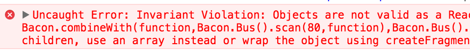
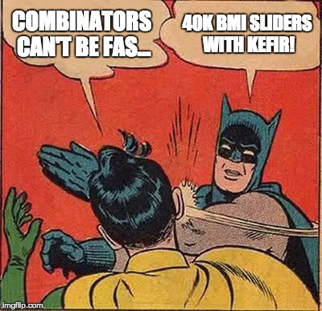

On Wednesday I watched Reactive2015 conference and [André Staltz](https://twitter.com/andrestaltz)’s
[talk](https://youtu.be/9cIEtC-V2XE?t=29172) about Cycle.js and its advantages compared
to React. The presentation was awesome but it was a bit misleading — you can do truly reactive
programming also with React by combining it with observables. It may not be so “declarative”
or “functional” as it is in Cycle but it works and it’s a really powerful way of creating UIs.

I really like Cycle.js. It is simple and declarative. But it has two caveats. First it has
hard RxJs dependency and that is too much: if I select a rendering library then I don’t want
it to constrain my state handling! Second, Cycle’s DOM event subscription system is not practical
(regardless how functional and “reactive” it may be): the emitted data must be encoded into
DOM (e.g. by using data attributes like data-id=”myId”). Just ugly.

### Single source of Truth. And its problems

> The state of your whole application is stored in an object tree inside a single store.

That is a direct quote from [Redux](http://redux.js.org/) website. The most of the current
Flux libraries use combined reducer and this has locked the developers’ mindsets to the fact
that the state should be like a mega sized “blob” which is passed to the “dummy” components
via props. And there is always **an explicit layer which separates the state handling and the UI**:
the top level “application container”. Perhaps you’ve seen this kind of lines in Redux apps:

```js
export default connect(
  mapStateToProps,
  mapDispatchToProps
)(App);
```

This single source of truth is a **good thing**! But the unfortunate truth is
**that it’s not how React is designed to work**. React’s Virtual DOM algorithm and its
performance relies heavily on components. Every time the state changes in “megablob”
applications, it triggers the virtual DOM rebuild for the **entire application**! And
that is slow, especially if you have a list with size of 100+. You are also forced to
continuously pass down the props which causes friction and slows down the development:
every time when new feature is added, you must add those props to your elements like

```jsx
<MyComponent newFeatureData={newFeatureData} />
```

Ever had some frustration when doing this kind of stuff? I’ve had. o/

### State with Observables

In this section I’ll expect that you have some basic knowledge about observables and
[Functional Reactive Programming](https://en.wikipedia.org/wiki/Functional_reactive_programming).
If you are not familiar with FRP, I strongly advice you to read
[this one](https://gist.github.com/staltz/868e7e9bc2a7b8c1f754) or watch the
Staltz’s Reactive2015 [presentation](https://www.youtube.com/watch?v=9cIEtC-V2XE&feature=youtu.be&t=29172).

Now that you are familiar with the basic concepts of FRP, we can start defining our
single source of Truth. In these examples I’m using Bacon.js but the same concepts apply
to other reactive libraries like Kefir and RxJs as well.

Let’s start. I’m about 80kg and 180cm and that’s the truth which can be described
by the means of observables:

```js
const weight = Bacon.constant(80);
const height = Bacon.constant(180);
```

Now that we have a weight and height, we can derive the BMI:

```js
const bmi = Bacon.combineWith(weight, height, (w, h) =>
  Math.round(w / (h * h * 0.0001))
);
```

And the coolest part of observables is that every time when either weight or height changes,
also the BMI changes. But weight and height are constants so they can’t be changed, right?
True. So let’s make actions which can modify them. I’m using `createAction` from
[MEGABLOB](https://github.com/milankinen/megablob) library. It creates a function which
can be called like any other functions. In addition, the arguments from function calls
are accessible as an observable via `.$` property:

```js
const setWeight = createAction();
const setHeight = createAction();
const weight = setWeight.$.scan(80, (_, newWeight) => newWeight);
const height = setHeight.$.scan(180, (_, newHeight) => newHeight);
```

And finally we can create the complete state model (Yes! the state model is just a plain
object that contains a set of “action creators” and observables):

```js
function bmiModel(initialWeight, initialHeight) {
  const setWeight = createAction();
  const setHeight = createAction();
  const weight = setWeight.$.scan(initialWeight, (_, w) => w);
  const height = setHeight.$.scan(initialHeight, (_, h) => h);
  const bmi = Bacon.combineWith(weight, height, (w, h) =>
    Math.round(w / (h * h * 0.0001))
  );
  return { setHeight, setWeight, weight, height, bmi };
}
```

And the application UI looks like this:

```jsx
function App() {
  const model = bmiModel(80, 180);
  const { setHeight, setWeight, weight, height, bmi } = model;
  return (
    <div>
      <h1>BMI counter</h1>
      <Slider title="Height" onChange={setHeight} value={height} />
      <Slider title="Weight" onChange={setWeight} value={weight} />
      Your bmi: {bmi}
    </div>
  );
}

function Slider({ title, onChange, value }) {
  return (
    <div>
      {title}: {value}
      <input
        type="range"
        min={50}
        max={200}
        value={value}
        onChange={e => onChange(e.target.value)}
      />
    </div>
  );
}

ReactDOM.render(<App />, document.getElementById("app"));
```

Looks correct, right? But something is wrong. If we run the application
we’ll get the following message to our debug console.



### The Truth about Observables and JSX


The error message pretty much nails it: _“Objects are not valid as a React child: Bacon…”._
Because **weight, height and bmi are Observables**, React can’t render them properly.

So there must be a way to “extract” the values from observables. And there is:
**observable combinators**. In Bacon there are `combineWith` (that was used before),
`combineAsArray` and `combineTemplate`. In Kefir, there is `combine` and in RxJs there
is `combineLatest`.

Because we are familiar with `combineWith`, let’s start with that one:

```jsx
function App() {
  const model = bmiModel(80, 180);
  const { setHeight, setWeight, weight, height, bmi } = model;
  return Bacon.combineWith(weight, height, bmi, (weight, height, bmi) => (
    <div>... jsx is same as before ...</div>
  ));
}
```

And now because our App function returns an `Observable<JSX>`, we can’t render it but
we can subscribe into it and render the emitted values (application JSX):

```jsx
App().onValue(app => {
  ReactDOM.render(app, document.getElementById("app"));
});
```

Works like a charm! But there is still way to much repetition with `Bacon.combineWith`.
Lets simplify it. And the key to this solution requires that you understand what is JSX.

Many people think JSX is an unicorn that breaths fire and such things. Nope. Not at all.
**JSX is just some fancy syntax sugar for a nested graph of plain JavaScript objects.**

> If it’s an object, we can traverse it — [Arnold Schwarzenegger](https://www.youtube.com/watch?v=eNr0WXQ3Ho4)

Well said, Arnold. That is exactly what `combineTemplate` does. It “lifts” the observables
from the nested object graph (JSX) and returns a new combined observable where original
observables are replaced with their actual values:

```jsx
function App() {
  const model = bmiModel(80, 180);
  const { setHeight, setWeight, weight, height, bmi } = model;
  return Bacon.combineTemplate(
    <div>
      <h1>BMI counter</h1>
      <Slider title="Height" onChange={setHeight} value={height} />
      <Slider title="Weight" onChange={setWeight} value={weight} />
      Your bmi: {bmi}
    </div>
  );
}
```

Much better. But the App still returns an observable so it cannot be used as element.
Fortunately we have good implementations for [Bacon](https://github.com/aparticka/react-bacon-component)
and [RxJs](https://github.com/acdlite/react-rx-component) how to create a reactive React component.
By using those it’s trivial to create the basic reactive application building block — 
_observable combinator_ component:

```jsx
const Combinator = createComponent(({ children }) =>
  children.flatMapLatest(Bacon.combineTemplate)
);
```

Now this `Combinator` component works like any other “normal” React component, except it
accepts Virtual DOM containing Observables. Let’s re-write the application UI by using
observable combinators.

```jsx
function App() {
  const model = bmiModel(80, 180);
  const { setHeight, setWeight, weight, height, bmi } = model;
  return (
    <Combinator>
      <div>
        <h1>BMI counter</h1>
        {renderSlider("Height", setHeight, height)}
        {renderSlider("Weight", setWeight, weight)}
        Your bmi: {bmi}
      </div>
    </Combinator>
  );
}

function renderSlider(title, onChange, value) {
  return (
    <div>
      {title}: {value}
      <input
        type="range"
        min={50}
        max={200}
        value={value}
        onChange={e => onChange(e.target.value)}
      />
    </div>
  );
}

ReactDOM.render(<App />, document.getElementById("app"));
```

Almost like “normal” React application but note that all components are pure. And if you take
a look at the `renderSlider` method, you can see that it is completely unaware whether the
given value is observable or not.

And the coolest thing is that even though the state models are nested, they still can be
treated as individuals when building your application. In other words, making states
containing N arbitrary sub-states (like lists) become fairly trivial:

```jsx
function bmiList(initial) {
  const addBmi = createAction()
  const bmis = addBmi.$.scan(initial, bmis => (
    [...bmis, bmiModel(80, 180)]
  ))
  const avg = bmis
    .map(models => models.map(m => m.bmi))
    .flatMapLatest(Bacon.combineAsArray)
    .map(bmis => _.sum(bmis) / bmis.length)
  return { bmis, addBmi, avg }
}

function App() {
  const list = bmiList([bmiModel(80, 180)])
  const { bmis, addBmi, avg } = list
  return (
    <Combinator>
      <div>
        Avg BMI {avg}
        <button onClick={addBmi}>Add BMI</button>
        <div>
          {bmis.map(models => models.map(renderBMI))}
        </div>
      </div>
    </Combinator>
  )
}

function renderBMI(model) {
  const { setHeight, setWeight, weight, height, bmi } = model
  return (
    ... same jsx as before ...
  )
}
```

Embedding observables to virtual DOM is not a new idea. For example Reagent and Yolk have done this for ages. The main goal of this article is just to show that same things can be done also with React and ES6.

More examples can be found from react-combinators Github project.


Embedding observables to virtual DOM is not a new idea. For example
[Reagent](https://reagent-project.github.io/) and [Yolk](https://github.com/yolkjs/yolk) have
done this for ages. The main goal of this article is just to show that
**same things can be done also with React** and ES6.

More examples can be found from react-combinators Github project.

More examples can be found from [**react-combinators** Github project](https://github.com/milankinen/react-combinators).

### How about performance?



**Are Combinators fast? Yes, they are.** Especially if there are only small
changes in the state at time, they outperform today’s popular megablob-architecture-flux
implementations easily.

The reason for the great performance is that combinators leverage (internally) the
React’s component based approach and its optimizations. `<Combinator>` elements act
like “guards” to the JSX they surround: if the identity of component’s child element
is not changed, then there is no need for virtual DOM diffing. If the child element
has changed, then it’ll be re-rendered. This leads to the situation where combinators
subscribe only to the observables that are embedded directly under their subtrees.
If sub-tree contains another `<Combinator>` element, observables inside that element
belongs to it. This nested structure ensures that only element (sub)trees
containing changed observables get updated.

This nested `<Combinator>` structure and high performance FRP library like Kefir,
enables the fast state handling of huge state trees containing e.g. long lists.
And no more `shouldComponentUpdate` hacks. Never again.

However, combinators are not a silver bullet. The small state changes are blazing
fast but in contrast, the **initial loading time is a bit longer** due to observable
subscriptions and extra virtual DOM traversal. I hope that this will get fixed in future.

### Conclusion

If you’re interested in reactive programming but want to stick with React, observable
combinators may be the thing you’re looking for. Currently supported libraries are
Kefir, Bacon.js and RxJs. Or if you’re not afraid of losing the React’s rich ecosystem
and community, take a look at Cycle.js or Yolk.
